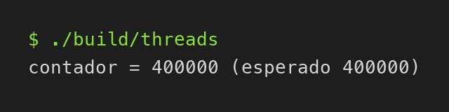
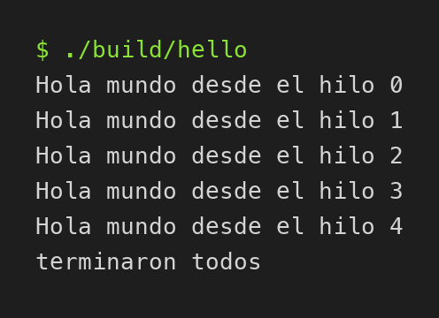

# cpp-threads-basico

Ejemplo muy básico de threads en C++17: se crean varios `std::thread`, todos
suman a un contador compartido protegido con `std::mutex` y `std::lock_guard`,
y al final se hace `join` de cada hilo.

Compilar y ejecutar:

    cmake -S . -B build
    cmake --build build
    ./build/threads

Debería imprimir `contador = 400000 (esperado 400000)`.

`./build/hello` es la versión de hola mundo con 5 hilos.

Salida de `threads`:

Salida de `hello`:

