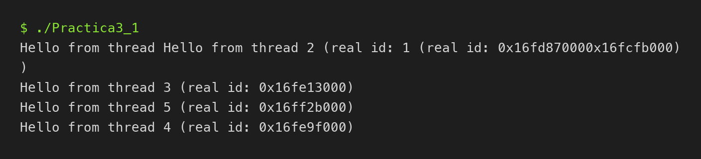
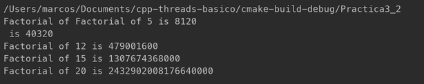

# cpp-threads-basico

Prácticas de threads en C++17. Cada práctica es un archivo en `src/`.

    cmake -S . -B build
    cmake --build build
    ./build/Practica3_1

## Práctica 1: primer programa multithreading

`src/Practica3_1.cpp` lanza 5 threads que ejecutan `greeting(id)` y espera a
que terminen.

**1) ¿Cómo lanzas los threads?**
Creo un `std::thread` pasándole la función y su id, y lo guardo en un
`vector`. Se hace dentro de un bucle, así salen 5 seguidos.

**2) ¿Cómo esperas a que terminen?**
Con `join()` en otro bucle aparte, después de lanzarlos todos. Hasta que no
acaban los 5, el `main` no sigue.

**3) ¿Qué llama la atención?**
El orden no es siempre el mismo y a veces las líneas salen mezcladas, porque
los threads escriben en `cout` a la vez. Los ids reales son distintos en cada
thread y cambian en cada ejecución.

## Práctica 2: paso de argumentos a threads

`src/Practica3_2.cpp` lanza 5 threads y cada uno calcula el factorial de un
número distinto (5, 8, 12, 15 y 20).

    ./build/Practica3_2

**1) ¿Cómo lanzas los threads y les pasas el número?**
Creo un `std::thread` por número: `thread t1(factorial, 5);`. La función
va primero y el número después, como argumento.

**2) ¿Cómo esperas a que terminen?**
Con `join()` en cada uno (`t1.join()` ... `t5.join()`), después de lanzarlos
todos. El `main` no acaba hasta que terminan los 5.

**3) ¿Qué llama la atención?**
Los resultados no salen en orden y a veces se mezclan dos líneas, como en la
primera práctica. Cada thread termina cuando le toca. Uso `unsigned long long`
porque con `int` el factorial se desborda desde el 13.

**4) Línea temporal** (el tiempo va hacia la derecha):

    main  |crea T1..T5|-- join T1 -- join T2 -- ... -- join T5 --|fin
    T1 5!             |###|
    T2 8!             |####|
    T3 12!            |#####|
    T4 15!            |######|
    T5 20!            |#######|

Los 5 threads nacen casi a la vez desde el `main`. Los `join` hacen que el
`main` espere a que acabe el último.

## Prueba anterior

`src/primer_contacto.cpp` es una prueba mía de antes: un contador compartido
protegido con mutex.
