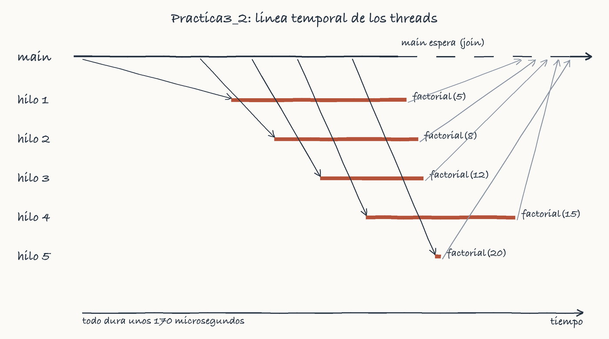
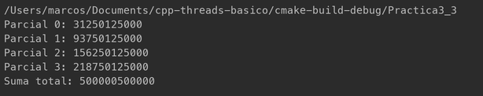
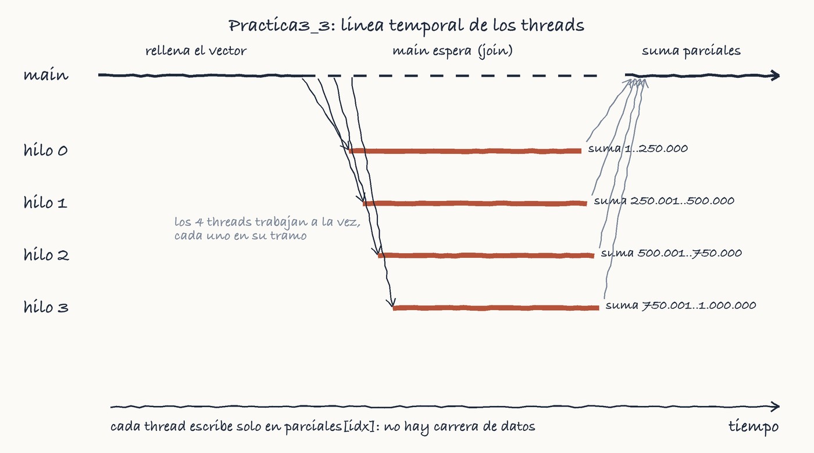
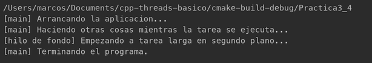
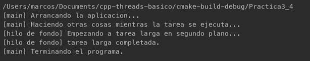
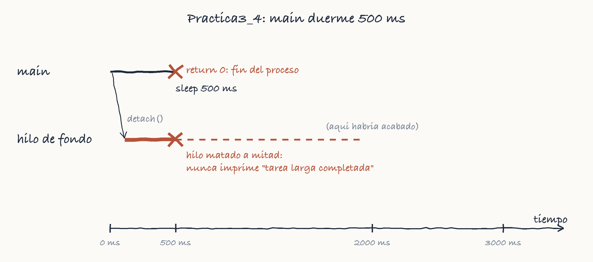
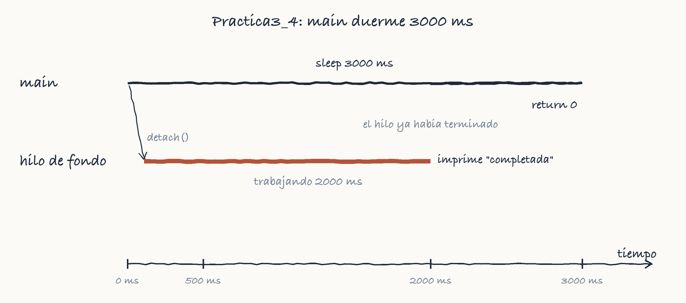

# cpp-threads-basico

Prácticas de threads en C++17. Cada práctica es un archivo en `src/`.

    cmake -S . -B build
    cmake --build build
    ./build/Practica3_1

## Práctica 1: primer programa multithreading

`src/Practica3_1.cpp` lanza 5 threads que ejecutan `greeting(id)` y espera a
que terminen.

**1) ¿Cómo lanzas los threads?**
Creo un `std::thread` pasándole la función y su id, y lo guardo en un
`vector`. Se hace dentro de un bucle, así salen 5 seguidos.

**2) ¿Cómo esperas a que terminen?**
Con `join()` en otro bucle aparte, después de lanzarlos todos. Hasta que no
acaban los 5, el `main` no sigue.

**3) ¿Qué llama la atención?**
El orden no es siempre el mismo y a veces las líneas salen mezcladas, porque
los threads escriben en `cout` a la vez. Los ids reales son distintos en cada
thread y cambian en cada ejecución.

## Práctica 2: paso de argumentos a threads

`src/Practica3_2.cpp` lanza 5 threads y cada uno calcula el factorial de un
número distinto (5, 8, 12, 15 y 20).

    ./build/Practica3_2

**1) ¿Cómo lanzas los threads y les pasas el número?**
Creo un `std::thread` por número: `thread t1(factorial, 5);`. La función
va primero y el número después, como argumento.

**2) ¿Cómo esperas a que terminen?**
Con `join()` en cada uno (`t1.join()` ... `t5.join()`), después de lanzarlos
todos. El `main` no acaba hasta que terminan los 5.

**3) ¿Qué llama la atención?**
Los resultados no salen en orden y a veces se mezclan dos líneas, como en la
primera práctica. Cada thread termina cuando le toca. Uso `unsigned long long`
porque con `int` el factorial se desborda desde el 13.

**4) Línea temporal**

Tiempos medidos en una ejecución. El `main` crea los 5
threads, que van empezando uno detrás de otro, y luego espera con los `join`
hasta que acaba el último.

## Práctica 3: paralelización

`src/Practica3_3.cpp` suma un vector de 1.000.000 de enteros (del 1 al
1.000.000) con 4 threads. Cada thread suma un cuarto del vector (250.000
números) y guarda el resultado en su casilla de `parciales`. Al final el
`main` suma los 4 parciales.

El resultado coincide con la fórmula n(n+1)/2 = 500.000.500.000.

**¿Por qué no hace falta mutex?**
Cada thread solo lee su tramo y solo escribe en su casilla de `parciales`, así
que nunca hay dos threads tocando lo mismo. La suma final la hace el `main`
después de los `join`.

**¿Para qué sirve `ref(datos)`?**
Sin `ref`, el thread haría una copia del vector de un millón de números.
Con `ref` usa el original.

**Línea temporal**

## Práctica 4: `detach()`

`src/Practica3_4.cpp` lanza un thread con una tarea larga de 2 segundos, le
hace `detach()` y el `main` espera un rato antes de terminar.

Con `detach()` el thread se independiza: ya no se puede hacer `join()` y el
`main` no lo espera. Pero sigue siendo parte del programa, así que cuando el
`main` llega al `return` el programa termina y se lleva por delante a todos los
threads, aunque no hayan acabado.

**Con `sleep_for(500 ms)`**

El `main` termina a los 500 ms, antes de que el hilo de fondo acabe sus 2000 ms.
El programa se cierra y el hilo muere a mitad, así que nunca sale el mensaje
"tarea larga completada".

**Con `sleep_for(3000 ms)`**

Ahora el `main` espera 3000 ms, más que los 2000 del hilo. La tarea termina,
escribe su mensaje y después acaba el `main`.

**Línea temporal con 500 ms**

**Línea temporal con 3000 ms**

**Conclusión**
`detach()` no hace que el thread viva más que el programa, solo quita la
posibilidad de esperarlo con `join()`. Esperar con `sleep_for` y adivinar el
tiempo no es fiable; si necesito que el thread acabe, tengo que usar `join()`.

## Prueba anterior

`src/primer_contacto.cpp` es una prueba mía de antes: un contador compartido
protegido con mutex.
